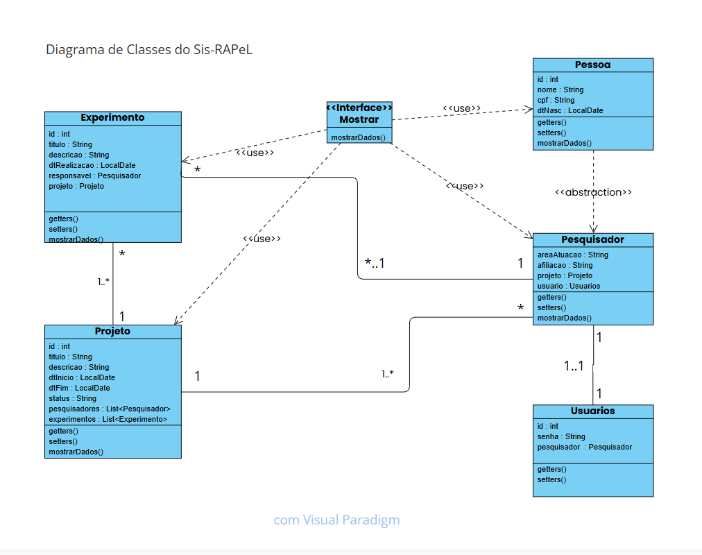

# **Sistema de Gerencia de Atividade em um Laboratório - Sis-RAPeL**

Repositório no git: 

## Introdução
  O sistema foi desenvolvido como atividade avaliativa final da disciplina de Linguagem de Programação Orientada à Objetos e tem o objetivo 
 de apresentar uma gerencia com menus interativos de atividades de pesquisa(experimentos) realizadas em um laboratório
  Busca facilitar a administração dos eventos que acontecem no ambiente, mais projetado para um formato onde vários projetos, pesquisadores
 e experimentos estão presentes, melhorando a gerência destes eventos 

## Forma de utilização
- O sistema começa em uma tela inicial onde o utilizador pode cadastrar ou acessar uma conta já presente no sistema
- Após o login, uma tela apresentando um menu simples com alguns botões que permitem acesso as funcionalidades de gerencia
- Os botões de acesso às listas completas de experiências e pesquisadores registrados apresentam todos aqueles presentes no banco, podendo
  modificar de forma geral estes
- Ao acessar a lista de projetos é possível ver informações e gerenciar os pesquisadores e experimentos relacionados a algum projeto
  selecionado, permitindo visualização apenas dos relacionados
- Permite o CRUD de cada objeto no sistema, possibilitando criar, visualizar, alterar ou remover dados

## Exemplo de Fluxo Esperado
### Adição e relacionamento de um novo Experimento a um Projeto
1. Um pesquisador inicia sistema
2. Este realiza um acesso a seu usuário, informando seu CPF e senha
3. Se CPF e senha estiverem corretos, o menu para gerência é aberto e uma mensagem de boas vindas aparece na tela
4. Para criar um novo experimento, o pesquisador acessa a lista de experimentos registrados
5. Com a interface de lista aberta, ele realiza uma adição de um novo experimento, informando os dados do mesmo
6. Caso tudo esteja correto, um novo experimento será então cadastrado
7. Com isso feito, o pesquisador acessa então o menu de gerencia de projetos
8. Neste menu, ele pode selecionar um projeto e acessar o botão para gerencia de experimentos relacionados ao mesmo
9. Assim uma lista com experimentos relacionados é aberta e é possível adicionar uma nova relação ao projeto
10. Ao utilizar do botão adicionar nesta lista, uma mensagem com uma escolha aparecerá onde é possível selecionar um experimento não relacionado
11. Após a seleção, o experimento então estará relacionado ao projeto selecionado persiste e é possível encerrar a sessão ou continuar a gerência

## Estrutura em MVC do Projeto
- src/main/java/model
   Experimento.java
   Mostrar.java
   Pesquisador.java
   Pessoa.java
   Projeto.java
   Usuarios.java
  
- src/main/java/model.dao
   ExperimentoDAO.java
   InterfaceBD.java
   PersistenciaJPA.java 
   PesquisadorDAO.java 
   ProjetosDAO.java
   Usuarios.java
  
- src/main/java/view
   CadastroExperimentoJD.java
   CadastroPesquisadorJD.java
   CadastroProjetoJD.java
   ListaExperimentosJF.java
   ListaPesquisadoresJF.java
   ListaProjetosJF.java
   ListaUsuariosJF.java
   MenuJF.java
   TelaInicialJF.java
   TelaLoginJD.java
  
- src/main/java/test
   TesteConexao.java
   

## Configuração do pom.xml
  O arquivo pom.xml foi configurado parcialmente com base no visto em aula, mas com versão 24 do java e utilizando:
  - javax V2.2 por conta da parte da persitencia e do padrão para JPA
  - Hibernate como ORM para trabalhar com banco
  - JDBC de postgre para conexão com banco postgresql
  - jaxb api que serve para transformar objetos anotados em formato xml

    
## Configuração do persistence
 O arquivo persistence trabalha com banco postgresql local sobre a unidade de persistencia pu_laboratorio tendo:
 - Hibernate como provedor para a forma do JPA
 - Driver para trabalho no postgresql
 - Está definido como update em relação à criação, mantimento e alteração dos dados no banco

## Diagrama de Relações

